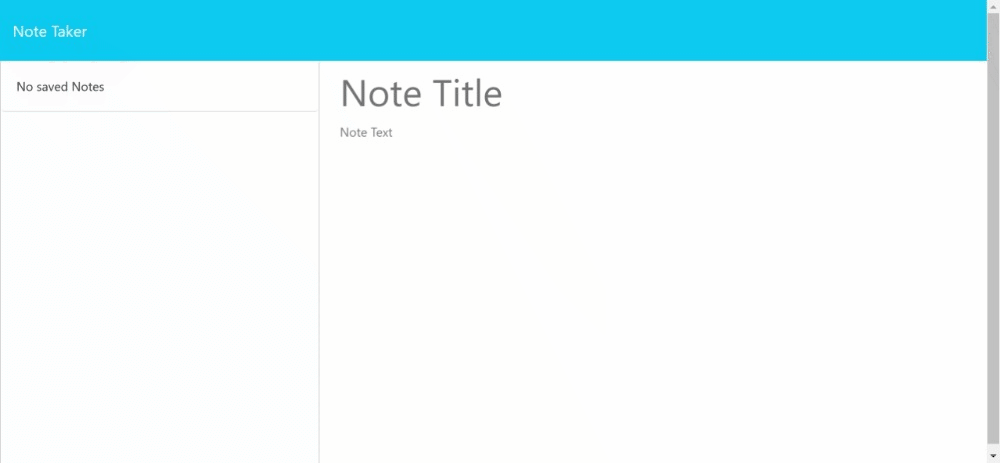

# Express.js-Note-Taker-Mutasim

## Challenge
my challenge was to create a back end application for an already made front end application. This aplication allowed a user to make and store notes and i had to create the backend for the user to store and display any notes they make.

## Descritpion
This aplication allows a user to make notes on a note taker. It uses express.js for its back end and will save and retrieve data from a JSON file. It allows a user to create a new note, look at old notes and delete previously made notes.

## Screenshot

## Link
